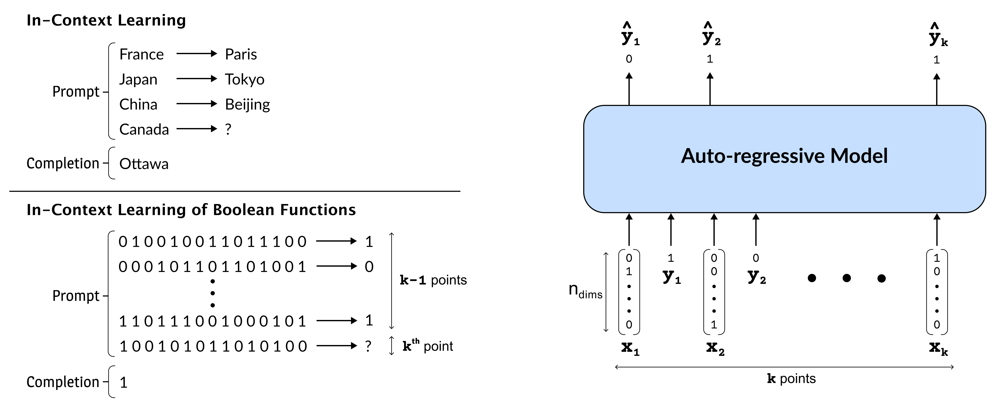

<h2 align="center">
  Understanding In-Context Learning in Transformers and LLMs by Learning to Learn Discrete Functions
</h2>
<p align="center">
  <a href="https://iclr.cc/"></a>
  <a href="https://openreview.net/pdf?id=ekeyCgeRfC"></a>
  <a href="https://github.com/satwik77/incontext-bool/blob/main/LICENSE">
    
  </a>
</p>


In order to understand the in-context learning phenomenon, <a href="https://arxiv.org/abs/2208.01066">recent works</a> have adopted a stylized experimental framework and demonstrated that Transformers can match the performance of gradient-based learning algorithms for various classes of real-valued functions. However, the limitations of Transformers in implementing learning algorithms, and their ability to learn other forms of algorithms are not well understood. Additionally, the degree to which these capabilities are confined to attention-based models is unclear. Furthermore, it remains to be seen whether the insights derived from these stylized settings can be extrapolated to pretrained Large Language Models (LLMs). In this work, we take a step towards answering these questions by demonstrating the following: (a) On a test-bed with a variety of Boolean function classes, we find that Transformers can nearly match the optimal learning algorithm for 'simpler' tasks, while their performance deteriorates on more 'complex' tasks. Additionally, we find that certain attention-free models perform (almost) identically to Transformers on a range of tasks. (b) When provided a *teaching sequence*, i.e. a set of examples that uniquely identifies a function in a class, we show that Transformers learn more sample-efficiently. Interestingly, our results show that Transformers can learn to implement *two distinct* algorithms to solve a *single* task, and can adaptively select the more sample-efficient algorithm depending on the sequence of in-context examples. (c) Lastly, we show that extant LLMs, e.g. LLaMA-2, GPT-4, can compete with nearest-neighbour baselines on prediction tasks that are guaranteed to not be in their training set.

<h2 align="center">
  
</h2>

#### Dependencies

- Compatible with python 3 and torch 1.11.0/2.1.0
- Dependencies can be seen in `incontext-bool/environment.yml`

#### Usage

Most of the relevant source code is in the `incontext-bool/src` directory. The set of command line arguments available can be seen in the respective `incontext-bool/src/args.py` file.

**Run Transformer on Conjunction**

At `incontext-bool/`:

```shell
$	python -m src.train -project in-context-learning -name test -family san -model_name gpt2 -task conjunction -data boolean -train_steps 15000 -n_dims 28 -n_embd 256 -n_layer 12 -n_head 8 -batch_size 64 -learning_rate 0.0001 -gpu 1
```

Check `src/args.py` for the list of tasks and models. 

**Run GPT-4 on Conjunction for direct evaluation**

At `incontext-bool/`:

```shell
$	python -m src.eval_openai -task conjunction -data boolean -n_dims 5 -n_points 50 -num_eval_examples 100 -prompt_type basic -model_type chat -model gpt-4
```

#### Citation

Our code is adapted from `https://github.com/dtsip/in-context-learning`. If you use our code, please cite our work:

```
@inproceedings{
bhattamishra2024understanding,
title={Understanding In-Context Learning in Transformers and {LLM}s by Learning to Learn Discrete Functions},
author={Satwik Bhattamishra and Arkil Patel and Phil Blunsom and Varun Kanade},
booktitle={The Twelfth International Conference on Learning Representations},
year={2024},
url={https://openreview.net/forum?id=ekeyCgeRfC}
}
```

For any clarification, comments, or suggestions please contact [Satwik](https://satwikb.com/) or [Arkil](http://arkilpatel.github.io/).
